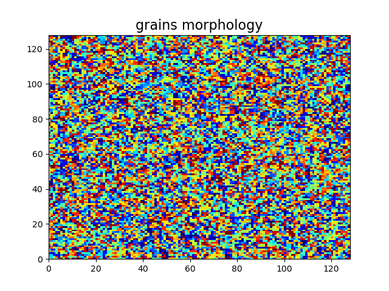

# grain growth in polycrystal

## Grain growth described by multi-phase field model, implemented by cross-platform parallel (CPU/**GPU**) computing language of Taichi

|  |  |
| ------------------------------------------------------------ | ------------------------------------------------------------ |

## Installation and Usage
1. install Python (3.8+) and pip, then install Taichi, numpy, and matplotlib
> pip install numpy  
> pip install taichi  
> pip install matplotlib

2. git clone this repo
3. go to the current directory of this repo, run the code in command line by:
> python ./polycrystal_grain_growth.py  

then two sub-windows will show up with grain morphology and grain boundary. 

## Model
Multi-phase field model is utilized to describe the polycrystal. For polycrystal: 
+ different grains with different orientations is regarded as different phases. 
+ Grain boundary is regarded as mixture of two adjacent grains. 
+ Liquid state (where multiple grains nucleate from) is regarded as mixture of multiple grains (mixed orientations of multiple grains, implying the amorphous structure of liquid). 

We set an initial fluctuation (perturbation) for liquid state, so that when it solidifies, it will nucleate multiple grains, and subsequent grain growth process will occur, such as:
+ big grain eating small grains
+ curve boundaries being straightened
+ triple-junctions forming

These phenomena can be seen from the above animations generated by simulation from this repo. 

### Phase Description
We use $\bf{\phi}(\bf{x}) = (\phi_{0}(\bf{x}), \phi_{1}(\bf{x}), ..., \phi_{n-1}(\bf{x}))$ to describe n different phases at position $\bf{x}$, where $\phi_{p}(\bf{x})$ describes the volume fraction of phase p. $\phi_{p}(\bf{x}) = 1$ implies that position **x** is totally occupied by phase p, and $\phi_{p}(\bf{x}) = 0$ implies that position **x** is totally absent of phase p. 

The grain boundary between grain p and grain q satisfies both $\phi_{p}(\bf{x}) > 0$ and $\phi_{q}(\bf{x}) > 0$, implying that position **x** is partially occupied by both phase p and q. Liquid state is represented by the mixture of all phases (mixing different grain-orientations to mimic the amophous structure), which means at position **x** we have $\phi_{p}(\bf{x}) > 0$ for all phases.

Obviously, the sum from $\phi_{0}(\bf{x})$ to $\phi_{n-1}(\bf{x})$ must equal 1 (and maintains 1 during computation), since the volume fraction of all phases together is always 100%. This constraint brings diffculties for numerical computation, but can be solved by [Steinbach's generalization of Ginzburg-Landau equation for multi-phase field](https://www.sciencedirect.com/science/article/abs/pii/S0167278999001293). 

### Free Energy 
Free energy is expressed as the functional of phase field (order parameters field). System will evolve from higher energe state to lower energy state. The decline of free energy drives the system to evolve, generating the grain growth process. 

It is expected that the grain boundary has higher energy compared to the grain's internal. Grain boundary's energy is expressed as:
$$\Psi_{GB}=\Sigma_{p < q}U_{pq}|\phi_{p}\phi_{q}| + (\kappa/2)\Sigma_{p}(\nabla\phi_{p})^{2}$$
where the first term is chemical energy and the second term is gradient energy. $U_{pq}$ is chemical energy coefficient of grain boundary between p and q, $\kappa$ is gradient energy coefficient. 

The additional energy penalty for multi-phase mixture (prevent mist-like phase-distribution obscuring the grain morphology) is:
$$\Psi_{pen} = U_{pen}\Sigma_{p < q < r}|\phi_{p}\phi_{q}\phi_{r}|$$

Thus, total free energy (functional of order parameters) is expressed as:
$$\Psi[\bf{\phi(x)}] = \Psi_{GB} + \Psi_{pen} = \Sigma_{p < q}U_{pq}|\phi_{p}\phi_{q}| + (\kappa/2)\Sigma_{p}(\nabla\phi_{p})^{2} + U_{pen}\Sigma_{p < q < r}|\phi_{p}\phi_{q}\phi_{r}|$$

## Governing Equation (decline of free energy)
[Steinbach's generalization of Ginzburg-Landau equation for multi-phase field](https://www.sciencedirect.com/science/article/abs/pii/S0167278999001293) is utilized to driving the phase-evolution, expressed as:

$$\dot{\phi}_{p}(\bf{x}) = -\frac{1}{n}\sum_{q}^{}M_{pq}(\frac{\delta\Psi}{\delta\phi_{p}}-\frac{\delta\Psi}{\delta\phi_{q}})$$ 

where n is the total number of different phases, $M_{pq}$ is the mobility between p and q, and the summation acts on all different phases. $-\delta\Psi/\delta\phi_{p}$ is the driving force for phase p, and expressed as:
$$-\frac{\delta\Psi}{\delta\phi_{p}} = -\frac{\partial\Psi}{\partial\phi_{p}} + \nabla\cdot\frac{\partial\Psi}{\partial\nabla\phi_{p}}$$

Using rate $\dot{\phi}_{p}(\bf{x})$, we can update the phase field during each time increment $\Delta t$  , where the 4th-order **Runge-Kutta** method (**RK4**) is utilized as time integration scheme. 

## References
+ Steinbach's generalization of Ginzburg-Landau equation for multi-phase field [https://www.sciencedirect.com/science/article/abs/pii/S0167278999001293](https://www.sciencedirect.com/science/article/abs/pii/S0167278999001293)
+ introduction of Taichi parallel computing language at github [https://github.com/taichi-dev/taichi](https://github.com/taichi-dev/taichi)
+ Taichi documentation [https://docs.taichi-lang.org/docs](https://docs.taichi-lang.org/docs)
+ physical explanation of grain growth [https://en.wikipedia.org/wiki/Grain_growth](https://en.wikipedia.org/wiki/Grain_growth)